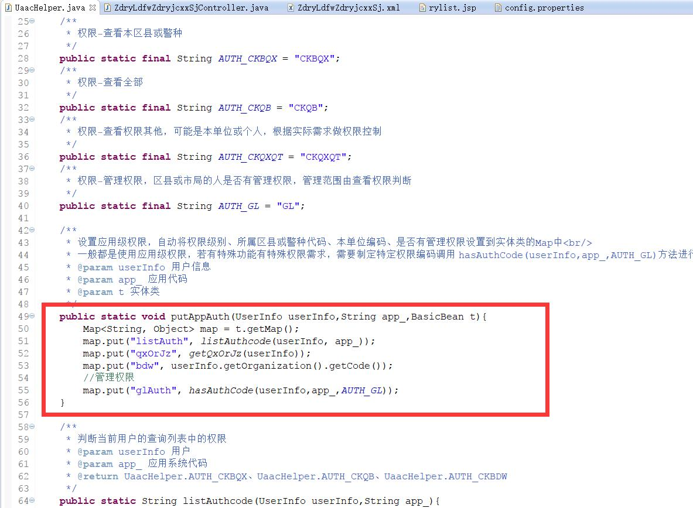
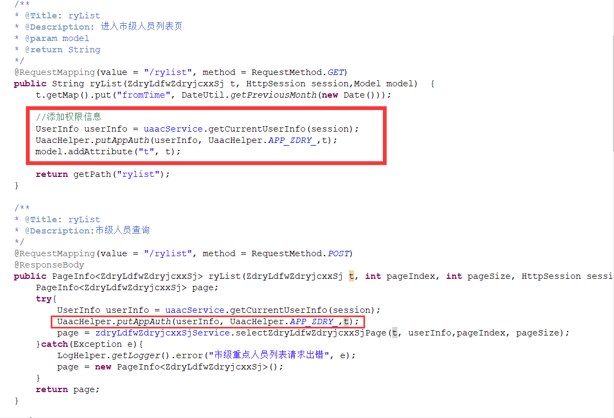
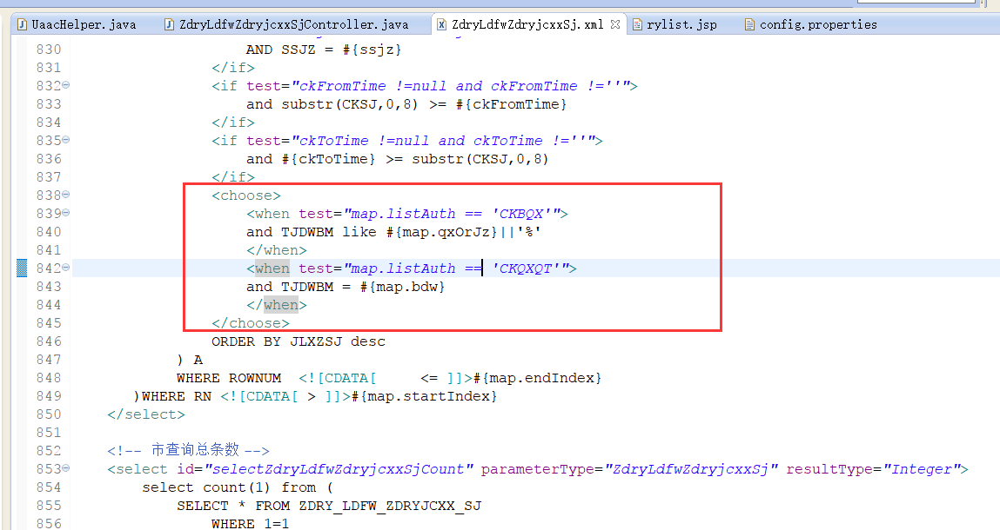
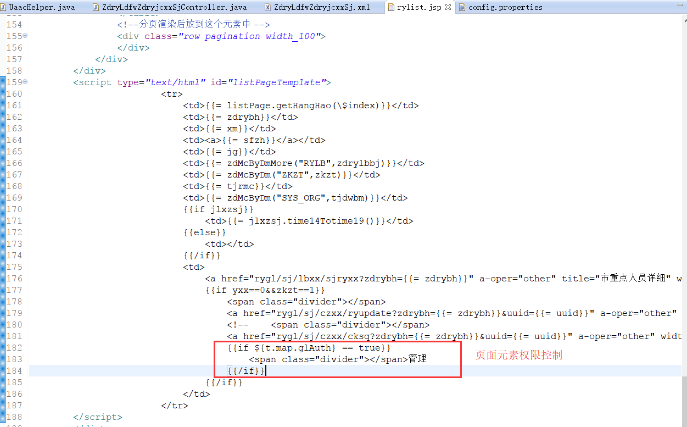
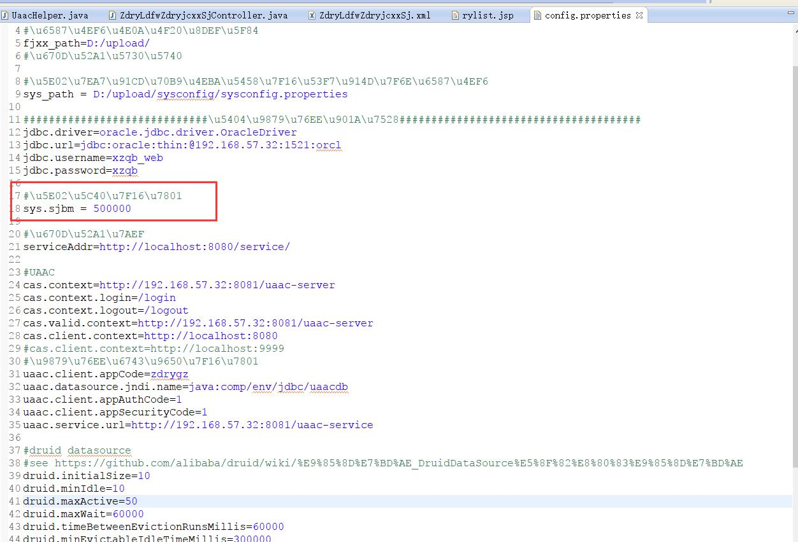
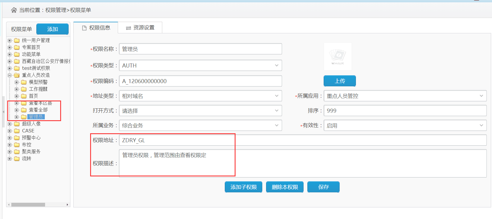
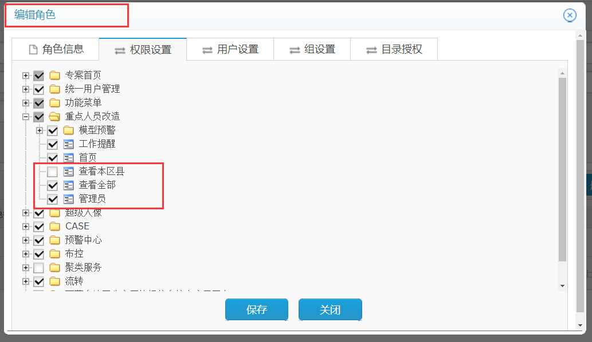

## 代码讲解

1. 权限封装类，一般调用红框的方法。 

1. 设置权限参考。 

1. sql文件中进行权限控制样例。 

1. 前端进行页面元素控制样例。 

1. 配置文件修改，sys.sjbm = 500000表示市局编码。 

## 使用讲解

1. 权限菜单添加。 

1. 通过uaac进行权限控制。 

1. 你们自己测试权限是否正确，可以建几个权限不同的用户进行测试。