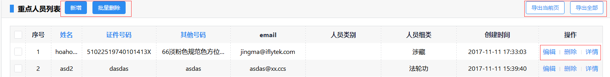
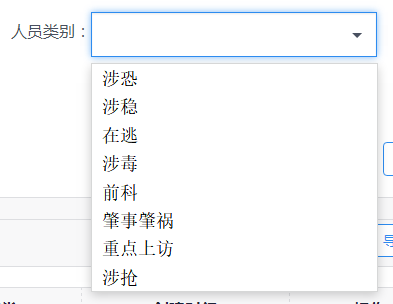
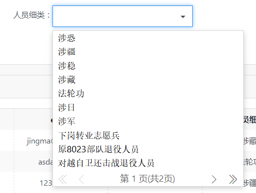
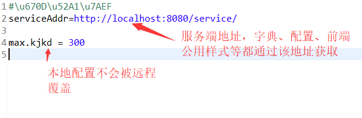
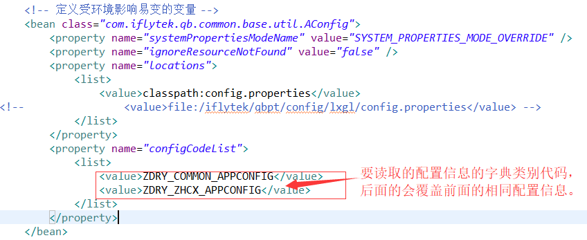
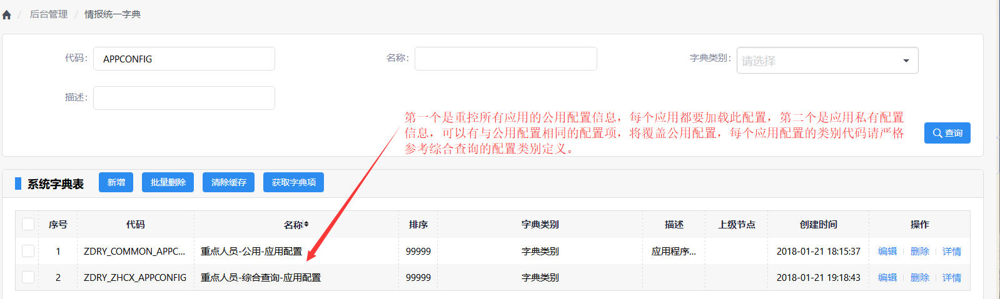
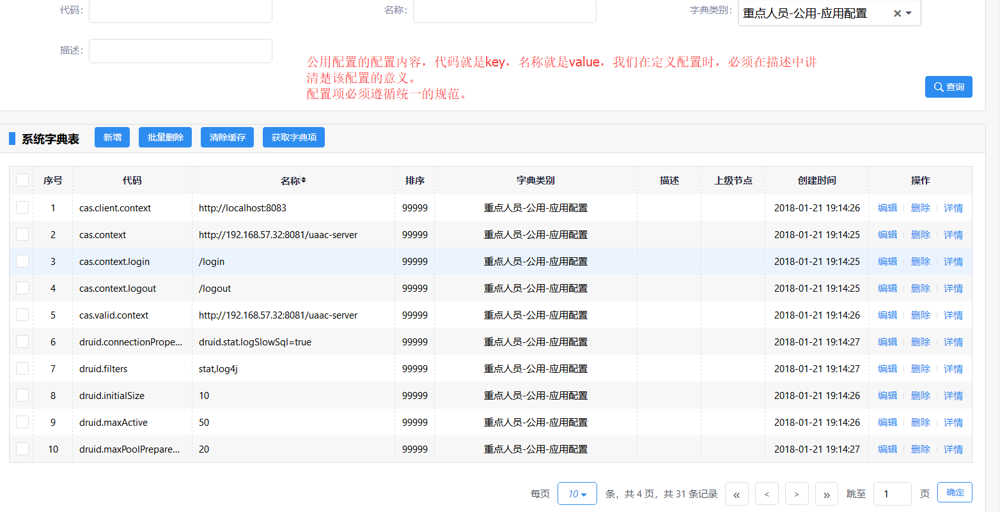

## 基础原则

### 通用要求

1. 系统测试要求分辨率宽度1280*768及以上，测试时要考虑左侧菜单栏，开发人员把要求的1280*768测一下，自己电脑的最大分辨率测一下，其他就交给测试吧，大家都参考demo，不要随意发挥。

1. 建议移除所有页面的位置导航信息，一来浪费空间，没有实际意义；二来客户经常进行菜单调整，这样就会导致菜单与位置导航不一致。


### 查询页面

1. 查询条件中的输入框非明确说明都是模糊搜索。

1. 列表页面一般都要有一个时间字段进行倒序排列，该时间字段还需要在查询条件中进行开始时间默认值设置，一般默认近一个月，应当视数据量大小而定，结束时间不用默认值。

1. 列表页面一般应当有三个权限级别：本单位、本区县或警种、全部，具体需要需求人员明确。本区县或本警种判断：500000开头的按前8位进行警种区分，其他按前6位进行区县区分，这个相关工具类已经封装好了，请直接使用。

1. 搜索条件中的时间范围无特殊说明只需要精确的天。

1. 同一个字段在一个系统中，无特殊要求应该描述一致，若原型有不一致，开发和测试应该提出来。

1. 按钮布局：类似导出这种使用较少，全局统一右边，其他业务操作类的都左边  

1. 弹出层（编辑、详情等）默认直接最大化，一些明显内容较少的再配置为合适的大小，系统中最好不要出现弹窗一层一层的情况。

1. 如证件类型、序号等数据宽度比较明确需要固定宽度，其他数据长度变化范围较大的不固定宽度，需要把握一个原则就是：固定宽度的列应该在大部分情况下都是完整展示的。

1. 查询列表上的操作一般的采用弹窗形式，弹窗中下方要有关闭按钮，明确特殊说明除外。

1. <span style="color:red">列表常用按钮要跟样例页面一致，不要每个系统随意定义，尤其是按钮名称定义。操作列统一命名例：编辑、删除、详情</span>


1. 列表中常见字段固定宽度。多选复选框列：35，序号：45，姓名：55，证件号码：135。

### 弹出页面

1. 页面第一个弹出层默认都最大化，页面下方都需要有统一的白底关闭按钮。

1. 弹窗页面的位置导航信息全部移除，改为在弹出框上描述，如：指令详情等。

### 提示语规范

1. 你确定要XXX吗？如：你确定要删除吗？、你确定要关闭吗？、你确定要提交吗？

1. “xx成功！”、“xx失败！”，如：布控成功！、撤控失败！

### 按钮规范

1. 弹出页面下方都需要有统一的白底关闭按钮。

1. 如领导操作的或不需要审核的，使用蓝底确定按钮。

1. 申请类操作，需要领导审核的都采用按钮：提交。

1. 工作未完成，临时保存的采用按钮：暂存。


## 文件上传


## 字典规范

情报库中新增T_SYS_ZD_TYZD表，所有的小字典都应该放在此表中，其他额外的大字典也需要配置到此表中，此表将成为所有字典的统一入口。

qbpt2项目中对字典的使用已经封装好了，你只需要到这个表中新增字典，然后在需要用的地方通过zdlb（字典类别）使用即可。

### 字典类别代码

字典类别代码建议规则：

1. 常用的如性别、民族、国籍等预计到处都能用到的，可以尽量简洁的命名，然后排序到前面,如：SYS_COMMON_XB(系统-通用-性别)，SYS_COMMON_MZ(系统-通用-民族)，SYS_COMMON_GJ(系统-通用-国籍)。

1. 如属于特定总队的，可以加上总队代码加以区分，如：JZ_JJZD_KKGCLX(警种-交警总队-卡口过车类型)。

1. 业务系统的按业务区分，如：ZDRY_GWDQ_DTXXLB(重点人员-高危地区-动态信息类别)

### 新增小字典

对于字典大小的定义，我们暂定1000个字典项以内的都按小字典处理，超1000个字典项的可以拆分独立字典表按大字典配置。

如下我们新增一个卡口过车类型的字典。

DM | MC | MS | PX | ZDLB
---|---|---|---|---
JJZD_KKGCLX | 交警-卡口过车类型 | 交警的卡口使用的车辆类型 | 99999 | ZDLB
1 | 大型车辆 |  | 99999 | JJZD_KKGCLX
2 | 小型车辆 |  | 99999 | JJZD_KKGCLX
3 | 警用车辆 |  | 99999 | JJZD_KKGCLX
4 | 领馆车辆 |  | 99999 | JJZD_KKGCLX
6 | 外籍车辆 |  | 99999 | JJZD_KKGCLX


### 新增大字典

这里的大字典包含本身字典项超出1000个的字典类别；本身并不是简单的字典，而是还包含其他属性的字典。

如下我们新增一个交警-卡口字典

DM | MC | MS | PX | ZDLB | LBSQL
---|---|---|---|---|---
JJZD_KKZD | 交警-卡口字典 | 交警-卡口字典 | 99999 | ZDLB | select kkbh as dm,Device_Name as mc,0 as px,kk.device_desc&brvbar;&brvbar;kk.device_ip as search_key from T_JJZD_KK_ZD_KKXX kk

### 字典管理

service中提供了字典管理功能，一般都请直接在页面进行字典管理，若是从其他地方导入过来的可以直接insert到字典表中，也是需要在页面添加相关字典类别的，方便管理。

### 前端字典使用

字典的常规使用都已经在[aui\a-utils\utils.js](../../../a-utils/utils.js)文件中写好了，我们只需按如下方式参考使用即可。

字典的几种展示形式：

1. 一般字典下拉框如下，人员类别的字典使用：

```html
<input type="text" zdlb="RYLB" pagination="false" selectOnly="true" class="form-control zdSelectPage" name="rylb">
```

1. 搜索下拉框的使用如下，卡口字典的搜索使用：

```html
<input type="text" zdlb="ZDRYXL" ajax="true" class="form-control zdSelectPage" name="ryxl">
```

### 后台字典使用

请参考：cn.benma666.iframe.DictManager

### 字典使用规范

字典的管理尽量在[服务端](http://localhost:8080/service/)中进行，若是从其他已经数据导入可以直接操作数据表。

## 配置中心

### 基础讲解

本配置中心基于同一字典管理实现，所有配置信息都以字典的形式管理，配置按优先级一般分为本地配置、私有配置、通用配置。

1. 本地配置：继承与spring自带配置，spring支持的配置形式都可以用于配置项目，本地配置中必须包含服务端地址。
1. 私有配置：各项目私有的配置，可以覆盖后面的通用配置。
1. 通用配置：各应用通用的配置项，最通用，优先级最低。

当前综合查询项目的配置管理已改造完成，请参考综合查询完成各项目基于配置中心的改造。

> 在启动应用前必须先启动service项目才能完成配置的加载。

### 基础运用

1. 在file:/benma666/config/myservice.properties文件中配置好服务端地址，所有项目都直接引用该配置文件，无需每个项目都去配置服务端地址,内容如下：
```#字典和样式等服务
service.addr=/myservice/
#service.addr=http://127.0.0.1:88/myservice/
#数据密码，用户对字段密码进行二次加密，核心密码。
data.password=xxx
sjzt.mm.ejmm=xxx
yhxx.yhmm.ejmm=xxxx
app.mm.ejmm=xxxx

#default数据源
default.jdbc.url=jdbc:oracle:thin:@127.0.0.1:1521:mydb
default.jdbc.username=sjsj
default.jdbc.password=sjsj

#web.init.classList=cn.benma666.km.job.KmWebInit
```

1. 在spring配置文件中参考如下配置：
```xml
	<!-- 定义受环境影响易变的变量 -->
	<bean class="cn.benma666.web.SConf">
		<property name="systemPropertiesModeName" value="SYSTEM_PROPERTIES_MODE_OVERRIDE" />
		<property name="ignoreResourceNotFound" value="false" />
		<property name="locations">
			<list>
				<value>file:/benma666/config/myservice.properties</value>
			</list>
		</property>
		<property name="configCodeList">
			<list>
				<value>SYS_COMMON_APPCONFIG</value>
				<value>SYS_MYSERVICE_APPCONFIG</value>
				<value>SYS_SJGL_APPCONFIG</value>
				<value>SYS_KP_APPCONFIG</value>
			</list>
		</property>
	</bean>

```

1. 在字典管理中进行配置的字典类别定义。

1. 在字典管理中进行对应的字典项配置，字典项的key全部采用小写加点分隔的形式，如：sys.sjbm，在配置字典时需要在描述中讲清楚该配置项的意义。



## 数据库规范

### 表名
表名统一采用三级命名规则：
1. 表名命名规范：系统拼音简称+业务拼音简称+表名称拼音简拼  例：重点人员系统，常规管控业务，预警信息  ZDRY_CGGK_YJXX
2. 视图统一用V开头
3. 统一字典表命名规范：SYS_ZD_XXX(系统-字典-统一字典)
4. 业务字典表命名规范：系统拼音简称 + ZD + 子业务描述 例： ZDRY_ZD_XXX

### 字段名称

字段命名采用中文简拼的方式命名，建议不要超过6个字符，非特殊情况字段名的简拼要与中文描述对应上。

中文描述结束采用英文分号分隔，后面可以进行额外的描述。如px字段的中文描述如下：
> 排序;建议排序都按10、20、30的方式排序，方便修改穿插

### 字段类型

字段类型统一规范为字符串类型，有特殊需要其他类型的具体分析，大家讨论认可即可，时间字段统一为长度为14的字符串。

### 默认字段

前面四个要求必须，后面字典理论要求要有，根据需要取舍

字段名称|类型|是否可为空|默认值|中文描述
---|---|---|---|---
UUID | VARCHAR2(32) | N | sys_guid() |  主键
CREATEDATE | VARCHAR2(14) | Y | to_char(sysdate,'yyyymmddhh24miss') |  创建时间
ETLDATE | VARCHAR2(14) | Y | to_char(sysdate,'yyyymmddhh24miss') |  更新时间
ISDEL | VARCHAR2(10) | Y | '0' |  是否删除;与共享平台一致，所以这里没有采用中文简拼命名
CJRXM | VARCHAR2(32) | Y | N | 创建人姓名
CJRDM | VARCHAR2(32) | Y | N | 创建人代码
CJRDWMC | VARCHAR2(256) | Y | N | 创建人单位名称
CJRDWBM | VARCHAR2(32) | Y | N | 创建人单位代码
